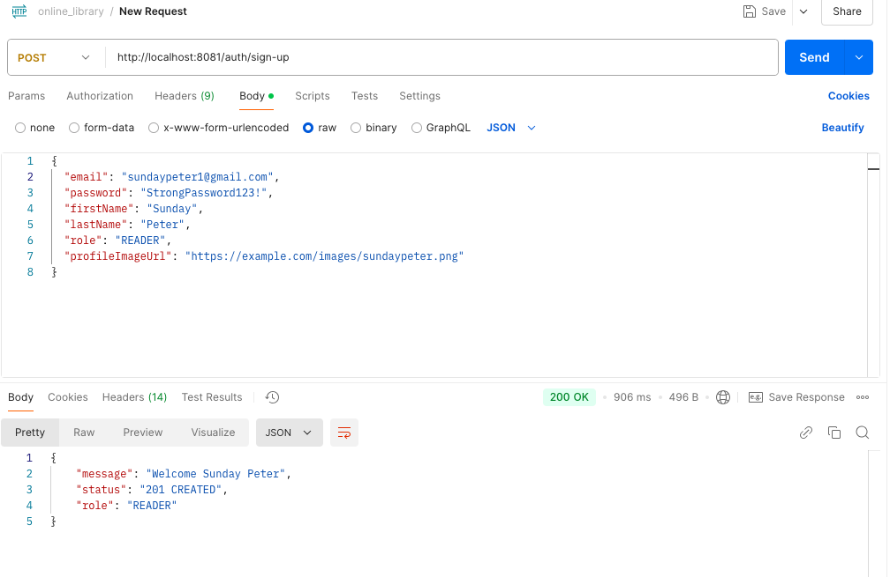
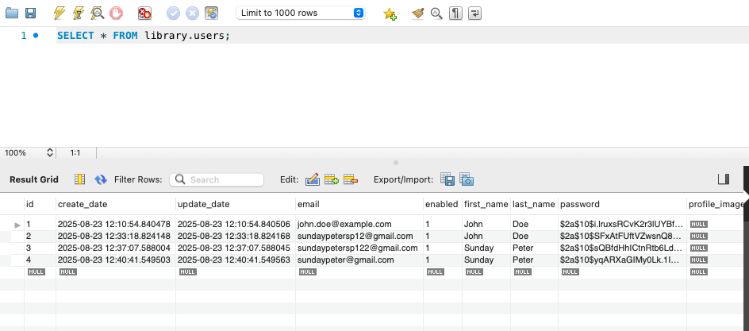
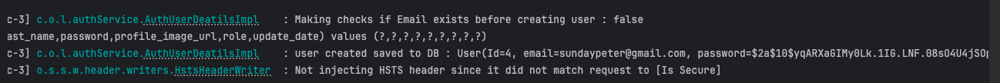
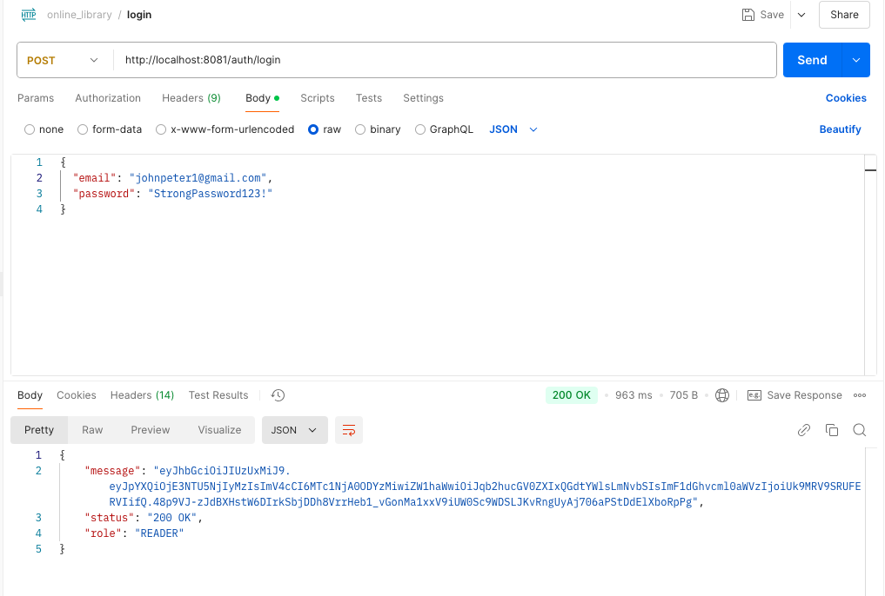
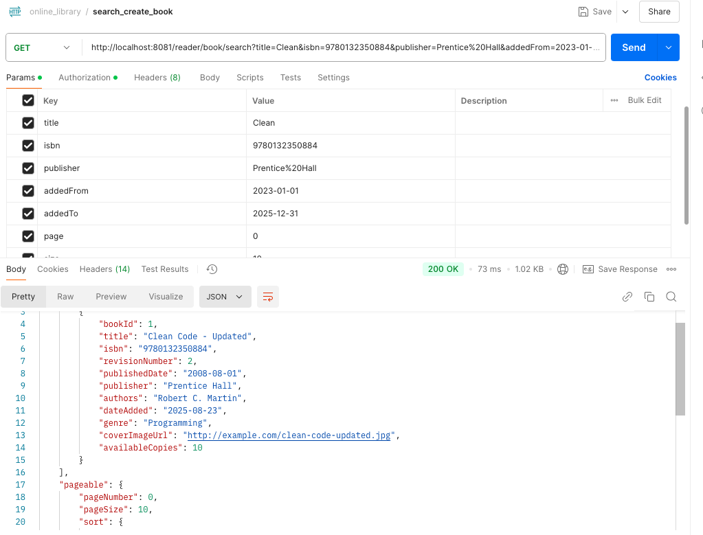
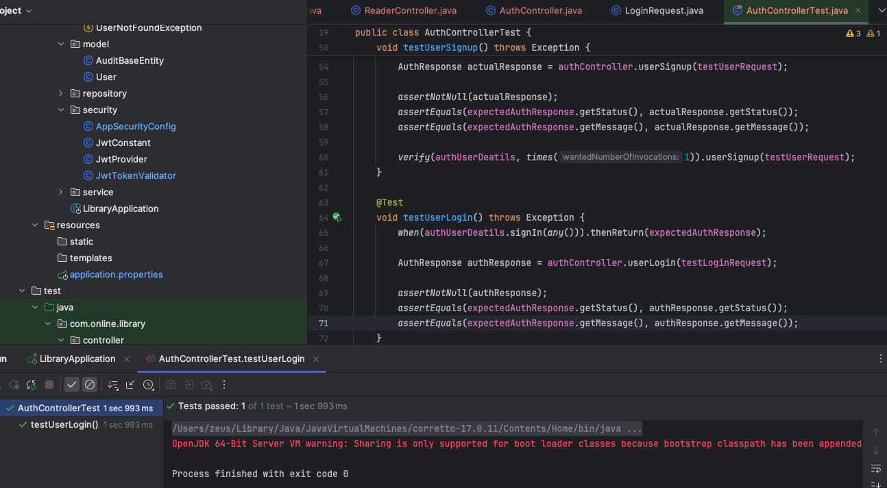
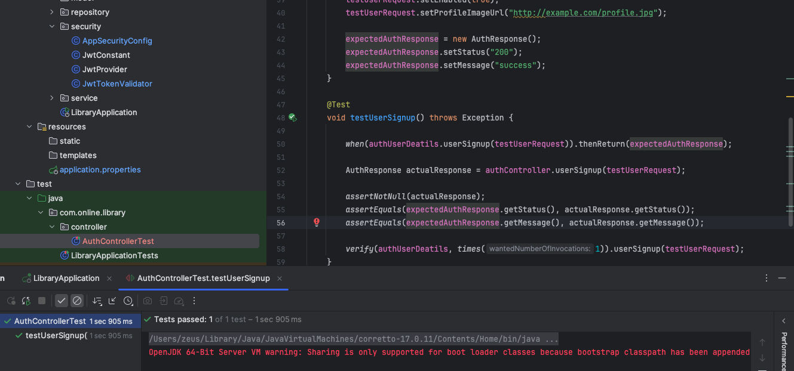
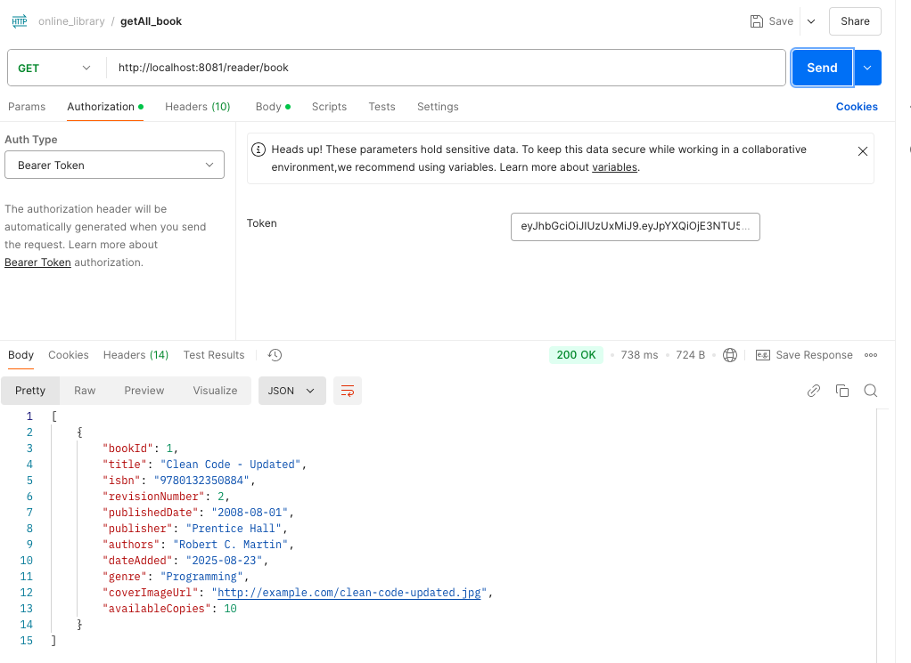
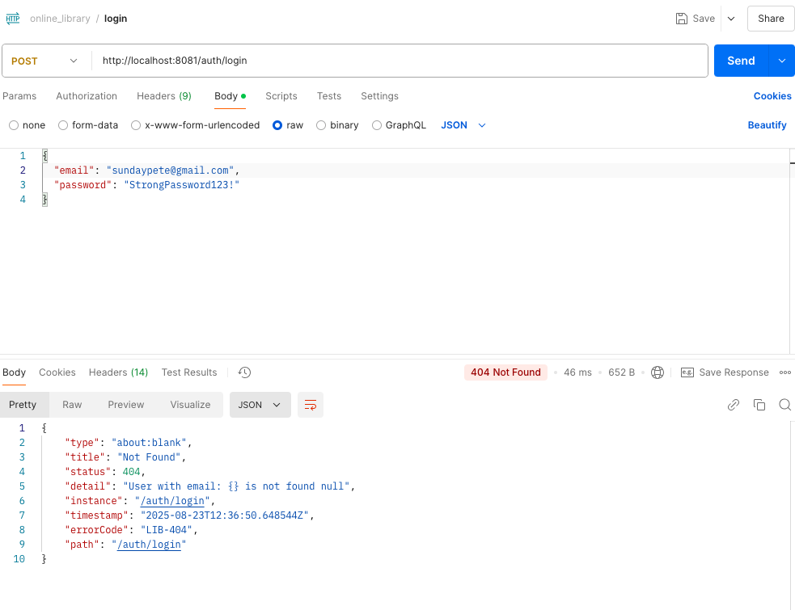
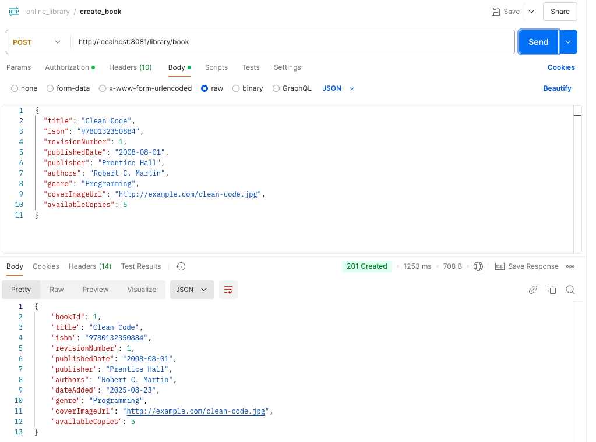

# Online Library

An enterprise-level **Online Library Management System** built with Spring Boot. This application allows users to register, log in, manage books, and perform advanced searches. It supports role-based access for librarians and readers.

---

## Table of Contents

- [Features](#features)
- [Endpoints](#endpoints)
- [Request Examples](#request-examples)
- [Screenshots](#screenshots)
- [Technologies](#technologies)
- [Setup](#setup)
- [License](#license)

---

## Features

- User Registration and Login
- Role-based authentication (`READER` and `LIBRARIAN`)
- Add, update, and manage books
- Search books with pagination and filtering
- RESTful API with JSON responses
- JWT Authentication for secure endpoints

---
## Endpoints

| Method | Endpoint | Description | Role |
|--------|----------|-------------|------|
| POST   | `/auth/sign-up` | Register a new user | Public |
| POST   | `/auth/login`   | Authenticate user and receive JWT | Public |
| POST   | `/library/book` | Add a new book | LIBRARIAN |
| PUT    | `/library/book` | Update existing book or create if missing | LIBRARIAN |
| GET    | `/reader/book` | Get all books | READER / LIBRARIAN |
| GET    | `/reader/book/search` | Search books with filters | READER / LIBRARIAN |
| POST   | `/library/checkout/update` | Update or create a checkout record | LIBRARIAN |
| POST   | `/reader/checkout/{bookId}` | Checkout a book | READER |
| POST   | `/reader/checkin/{checkoutId}` | Checkin a book | READER |
---

## Request Examples

### 1. Sign Up

### 2. Login

### 3. Search

### 4. login Unit Test

### 5. Get All_book

### 6. Sample of failed Login/Failure response

### 7. Create Book

